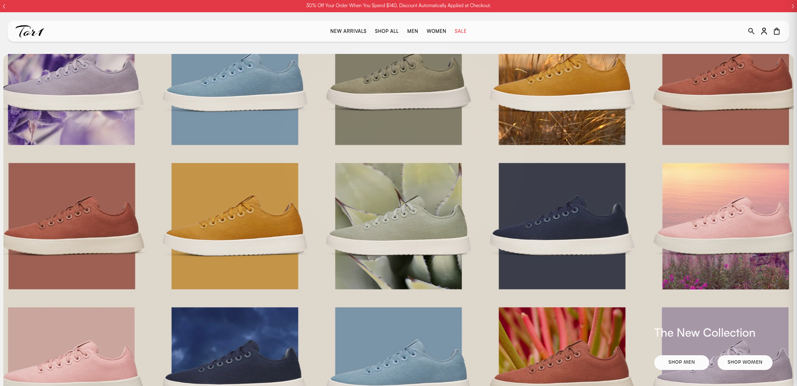
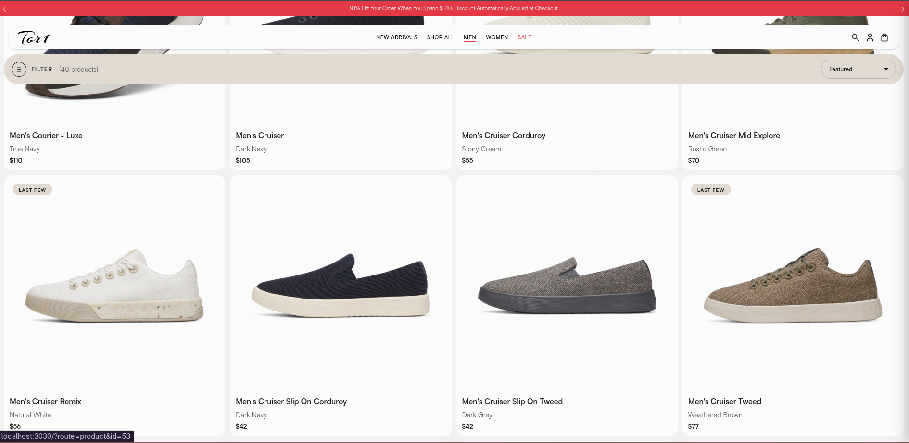
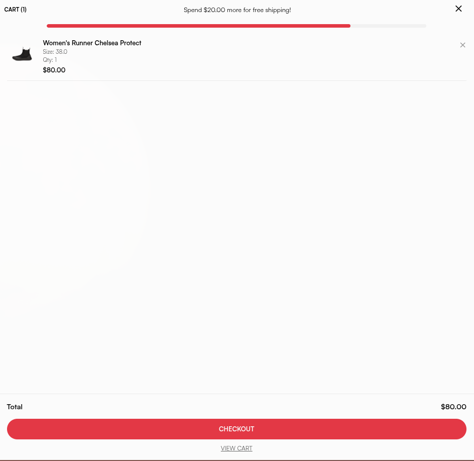
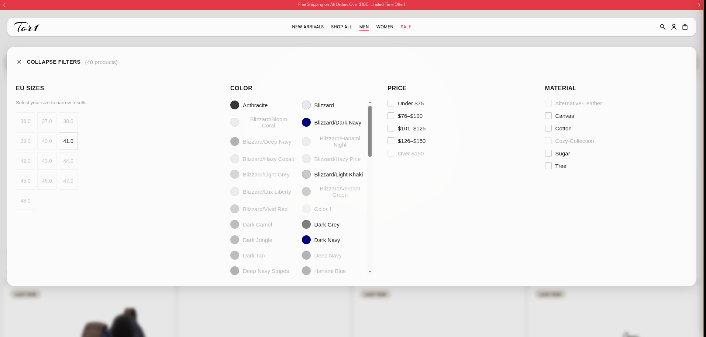

# Tory — E-Commerce Shoes Store

> **A full-featured running shoe store with product catalog, variant management, cart, checkout, and admin panel.**

[](https://php.net/)
[](https://mysql.com/)
[](https://gsap.com/)
[](https://jquery.com/)
[](https://tailwindcss.com/)
[](https://developer.mozilla.org/en-US/docs/Web/JavaScript)
[](https://www.php.net/manual/en/book.pdo.php)

---

## Screenshots

| Homepage                      | Products Catalog                      |
| ----------------------------- | ------------------------------------- |
|  |  |

| Product Detail                                  | Shopping Cart                 |
| ----------------------------------------------- | ----------------------------- |
|  |  |

| Search                                   | Filtering                           |
| ---------------------------------------- | ----------------------------------- |
|  |  |

| Home Sections                       |
| ----------------------------------- |
|  |

| Home Sections                       |
| ----------------------------------- |
|  |

| Home Sections                       |
| ----------------------------------- |
|  |

---

## The Story

Tor1 was built as a school project to design and implement a complete e-commerce platform from the ground up — from database schema to pixel-perfect frontend.

Every part of the shopping experience was crafted by hand:

- A **product catalog** with color swatches, size selection, and real-time stock awareness
- A **shopping cart** that persists across sessions and updates quantities on the fly
- A **checkout flow** with shipping rules, delivery assignment, and order management
- A **full admin panel** — products, orders, users, inventory, brands, categories, discounts, collections, shipping rules, and audit logs
- **Variant-level pricing** with percentage or fixed discounts
- **Server-side filtering** by price, color, material, and size

---

## Features

### Catalog & Shopping

- **Gender-based browsing** — Men's, Women's, Shop All
- **New Arrivals & Sale** sections with badge indicators
- **Product detail pages** with gallery, color swatches, and size grid
- **Real-time stock awareness** — out-of-stock variants are visually disabled
- **Variant-level discounts** — percentage or fixed price
- **Search** with server-side full-text lookup
- **Server-side filtering** — price range, color, material, size

### Cart & Checkout

- **Session-based cart** — add, remove, update quantities
- **Quantity controls** with increment/decrement and direct input
- **Shipping rules** — free shipping threshold, city-based delivery
- **Order management** — delivery assignment and status tracking

### User Accounts

- **Registration & login** with bcrypt password hashing
- **Account dashboard** with order history
- **Role-based access** — user, admin, delivery guy

### Admin Panel

- **Dashboard** — total products, orders, users, revenue, pending orders, low stock alerts
- **Products** — CRUD with brand, category, gender, pricing
- **Orders** — filter by status, assign delivery, update shipping status
- **Users** — manage roles and city assignments
- **Inventory** — variant-level stock tracking with restock form
- **Brands & Categories** — manage product taxonomy
- **Discounts** — create promo codes (percentage/fixed)
- **Collections** — organize products into curated groups
- **Shipping Rules** — configure free shipping thresholds per city
- **Audit Logs** — track administrative actions

### Design & UX

- **Custom typography** — Satoshi, Chillax, Telma, Blackbird fonts
- **Fully responsive** — mobile-adapted layout and navigation
- **Product reviews** — star ratings, verified purchase badges
- **Sustainability section** — brand storytelling and material highlights

---

## Tech Stack

| Layer        | Tech                                           |
| ------------ | ---------------------------------------------- |
| **Backend**  | PHP 8+, PDO (MySQL/MariaDB)                    |
| **Frontend** | Vanilla JavaScript, jQuery, GSAP               |
| **Styling**  | CSS (custom), Tailwind CSS (admin panel)       |
| **Fonts**    | Satoshi, Chillax, Telma, Blackbird             |
| **Icons**    | Material Icons, Material Symbols, Font Awesome |
| **Database** | MySQL / MariaDB                                |
| **Auth**     | Session-based with bcrypt                      |

---

## Getting Started

### Prerequisites

- **PHP** 8+ with PDO MySQL extension
- **MySQL** 8+ or **MariaDB**

### Installation

```bash
# 1. Clone the repository
git clone git@github.com:G13Q/Running.git
cd Running

# 2. Create the database
mysql -u root -p -e "CREATE DATABASE runningdb"

# 3. Import schema and seed data
mysql -u root -p runningdb < running_shoes_website_db.sql
mysql -u root -p runningdb < seed.sql

# 4. Configure environment variables
cp .env.example .env
# Edit .env with your database credentials

# 5. Start the development server
php -S localhost:8000
```

The application will be available at `http://localhost:8000`.

---

## Project Structure

```
├── assets/
│   ├── css/               # Stylesheets (views/, home/, components/)
│   ├── fonts/             # Custom fonts (Satoshi, Chillax, Telma, Blackbird)
│   ├── icons/             # Logo and icon assets
│   ├── images/            # Product and marketing images
│   └── js/                # JavaScript modules (home/, shared/)
├── config/
│   └── database.php       # Database connection configuration
├── controllers/           # Route handlers (Auth, Cart, Product, Admin, etc.)
├── models/                # Database query models
├── utils/                 # Helper functions
├── views/
│   ├── components/        # Reusable UI partials (navbar, footer, product card, filter panel)
│   └── tabs/              # Admin tab views
├── screenshots/           # Application screenshots
├── .env.example           # Environment variable template
├── index.php              # Application entry point
├── routes.php             # Route definitions
├── running_shoes_website_db.sql  # Database schema
├── seed.sql               # Demo data
└── update-size.sql        # Size migration script
```

---

## Routes

| Route                  | Page               |
| ---------------------- | ------------------ |
| `/` or `?route=home`   | Homepage           |
| `?route=shop-all`      | All products       |
| `?route=mens`          | Men's collection   |
| `?route=womens`        | Women's collection |
| `?route=new-arrivals`  | New arrivals       |
| `?route=sale`          | Sale items         |
| `?route=search`        | Search results     |
| `?route=product&id=`   | Product detail     |
| `?route=cart`          | Shopping cart      |
| `?route=checkout`      | Checkout           |
| `?route=login`         | Login              |
| `?route=register`      | Register           |
| `?route=account`       | Account dashboard  |
| `?route=logout`        | Logout             |
| `?route=admin&action=` | Admin panel        |

---

## Admin Panel

Accessible at `?route=admin&action=dashboard` after logging in with an admin account.

| Action             | Description                                |
| ------------------ | ------------------------------------------ |
| `dashboard`        | KPI cards, recent orders, low stock alerts |
| `products`         | Product CRUD table                         |
| `product-create`   | Add new product form                       |
| `product-edit&id=` | Edit existing product                      |
| `orders`           | Order management with status filter        |
| `users`            | User management                            |
| `user-edit&id=`    | Edit user details & role                   |
| `inventory`        | Variant stock tracking & restock form      |
| `brands`           | Brand management                           |
| `categories`       | Category management                        |
| `discounts`        | Discount code creation                     |
| `collections`      | Product collections                        |
| `cities`           | City management for shipping               |
| `shipping-rules`   | Free shipping threshold rules              |
| `audit-logs`       | Admin action history                       |

---

## Architecture Notes

- **MVC-inspired structure** — Controllers handle routing logic, models contain queries, views render HTML
- **Session-based cart** — no database writes until checkout
- **Variant system** — each product has multiple color/size variants with individual stock and SKU tracking
- **Discount engine** — supports percentage discounts and fixed price overrides at the variant level
- **Seeded demo data** — ready to explore immediately with pre-populated products, users, and orders

---

## License

MIT
